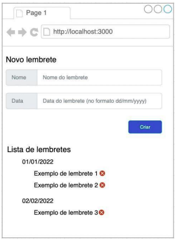

# Reminder Manager

## Sumário

- [Sobre](#sobre)
- [Tecnologias](#tecnologias)
- [Instruções para Executar o Sistema](#instruções-para-executar-o-sistema)
- [Executando o Backend](#executando-o-backend)
- [Executando o Frontend](#executando-o-frontend)
- [Features](#Features)
- [Demonstração do projeto](#demonstração-do-projeto)

## Sobre

Aplicação web responsável pela gestão de lembretes. Este projeto foi desenvolvido para um teste prático para um processo seletivo.

## Sobre o Teste

#### Instruções gerais

- Fazer a prova em NodeJS (backend) e ReactJS (frontend);
- A aplicação deve ser web;
- O código deve ser executável;
- Você pode utilizar de quaisquer bibliotecas de componentes que desejar;

#### Bônus

- Testes unitários;
- Não utilizar biblioteca de componentes;
- Utilização de CSS/SCSS modules ou Styled Components;

#### O que deve ser construído

Você deverá desenvolver um sistema de criação de lembretes, seguindo a ideia abaixo:



Lembrando que a imagem é ilustrativa.

#### Ao utilizar o sistema

- Deverá ser possível adicionar um novo lembrete, informando o nome e a data do lembrete
- Ao clicar em “Criar”, os campos deverão ser validados seguindo as regras:
```bash
=> O campo “Nome” deverá estar preenchido
=> O campo “Data” deverá estar preenchido, com uma data válida, e essa data
tem de estar no futuro
```
- Caso os valores dos campos sejam válidos, o novo lembrete deverá ser exibido na seção “Lista de lembretes”
- Deverá ser possível deletar um lembrete anteriormente adicionado, clicando no “x”
- Ao adicionar um novo lembrete, caso a sua data já exista, ele deverá aparecer dentro da lista referente àquele dia; caso não, um novo dia deverá ser exibido, contendo aquele novo dia
- Os dias da lista de lembretes deverão ser exibidos em ordem cronológica

## Tecnologias

- [Create React App](https://create-react-app.dev/)
- [Node.js](https://nodejs.org/)
- [Express](https://expressjs.com/)

## Instruções para Executar o Sistema

Para baixar o repositório em sua máquina, utilize o comando:

```bash
# Clone o repositório
git clone https://github.com/ArthurLelis/ReminderManager.git
```

E depois:

```bash
# Acesse o diretório do projeto
cd ReminderManager
```

### Executando o Backend

Para iniciar a execução do backend:

1.  Acesse a pasta **api**: `cd api`.
2.  Execute: `npm install`.
3.  Execute: `npm start`.

Para executar os testes unitários, siga os passos 1 e 2 acima e, em seguida, execute: `npm test`.

### Executando o Frontend

Para iniciar a execução do frontend:

1.  Acesse a pasta **fe**: `cd fe`.
2.  Execute: `npm install`.
3.  Execute: `npm start`.

Para executar os testes unitários, siga os passos 1 e 2 acima e, em seguida, execute: `npm test`.

## Features
- Criar banco de dados;
- Editar lembrete;
- Login/Logout;
- Alterar tema;
- Excluir vários lembretes de uma vez;

## Demonstração do projeto

[](https://www.youtube.com/embed/L1kKDZL6ky4?si=HWu7i8dHiDIto_wv)
